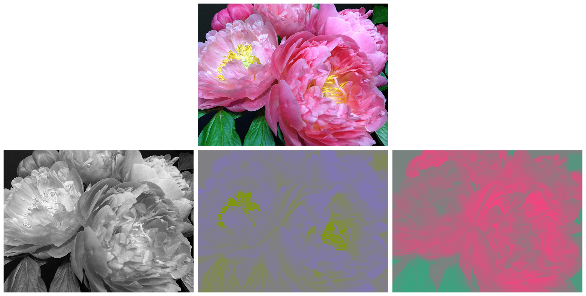

# Applying vImage Operations to Video Sample Buffers

Use vImage's convert-any-to-any function to perform real-time image processing of video frames streamed from your device's camera.

## Overview

You can combine vImage operations with AVFoundation to process individual video frames in real time. This sample describes how to use the `vImageConvert_AnyToAny(_:_:_:_:_:)` function to create a single RGB image from the separate luminance (Y) and two-channel chrominance (CbCr) channels provided by an [`AVCaptureSession`](https://developer.apple.com/documentation/avfoundation/avcapturesession).

The example below shows how an image (top) is split into luminance (bottom left), Cb chrominance (bottom middle), and Cr chrominance (bottom right) channels:



This sample walks you through the steps for applying a histogram equalization operation to a video sample buffer:

1. Configuring AVFoundation.
2. Defining reusable variables.
3. Creating a converter.
4. Creating source vImage buffers.
6. Initializing a destination buffer.
7. Converting the video frame to an ARGB8888 image.
8. Applying a histogram equalization operation to the destination image.
9. Creating a displayable `UIImage` from the destination buffer.

## Configure AVFoundation

For a complete discussion of how to manage the capture from a device such as a camera, see [Still and Video Media Capture](https://developer.apple.com/library/content/documentation/AudioVideo/Conceptual/AVFoundationPG/Articles/04_MediaCapture.html#//apple_ref/doc/uid/TP40010188-CH5-SW2) in the [AVFoundation Programming Guide](https://developer.apple.com/library/content/documentation/AudioVideo/Conceptual/AVFoundationPG/Articles/00_Introduction.html#//apple_ref/doc/uid/TP40010188-CH1-SW3). For this sample, use this code to configure and start running a session:

``` swift
let captureSession = AVCaptureSession()

func configureSession() {
    captureSession.sessionPreset = AVCaptureSession.Preset.photo
    
    guard let backCamera = AVCaptureDevice.default(for: .video) else {
            statusLabel.text = "Can't create default camera."
            return
    }
    
    do {
        let input = try AVCaptureDeviceInput(device: backCamera)
        captureSession.addInput(input)
    } catch {
        statusLabel.text = "Can't create AVCaptureDeviceInput."
        return
    }
    
    let videoOutput = AVCaptureVideoDataOutput()
    
    let dataOutputQueue = DispatchQueue(label: "video data queue",
                                        qos: .userInitiated,
                                        attributes: [],
                                        autoreleaseFrequency: .workItem)
    
    videoOutput.setSampleBufferDelegate(self,
                                        queue: dataOutputQueue)
    
    if captureSession.canAddOutput(videoOutput) {
        captureSession.addOutput(videoOutput)
        captureSession.startRunning()
    }
}
```

After the capture session starts running, `captureOutput(_:didOutput:from:)` is called for each new `videoOutput` frame. Before you pass the pixel buffer (which contains the image data for the video frame) to vImage for processing, lock it to ensure that your processing code has exclusive access. When you're finished with the pixel buffer, you can unlock it.

``` swift
func captureOutput(_ output: AVCaptureOutput,
                   didOutput sampleBuffer: CMSampleBuffer,
                   from connection: AVCaptureConnection) {
    
    guard let pixelBuffer = CMSampleBufferGetImageBuffer(sampleBuffer) else {
        return
    }
    
    CVPixelBufferLockBaseAddress(pixelBuffer,
                                 CVPixelBufferLockFlags.readOnly)
    
    displayEqualizedPixelBuffer(pixelBuffer: pixelBuffer)
    
    CVPixelBufferUnlockBaseAddress(pixelBuffer,
                                   CVPixelBufferLockFlags.readOnly)
}
```

## Define Reusable Variables

Reusing vImage buffers is especially important when working with video. If you try to reallocate and zero-fill the buffers with each frame, you're likely to experience performance issues. To enable buffer reuse, declare them outside of the `captureOutput(_:didOutput:from:)` method of the sample buffer's delegate.
(The same is true for the converter that defines the source and destination types for the convert-any-to-any function.)

``` swift
var converter: vImageConverter?

var sourceBuffers = [vImage_Buffer]()
var destinationBuffer = vImage_Buffer()
```

## Create a Core Video-to-Core Graphics Converter

vImage's convert-any-to-any function requires a converter that describes the source and destination formats. In this example, you're converting from a Core Video pixel buffer to a Core Graphics image, so you use the `vImageConverter_CreateForCVToCGImageFormat(_:_:_:_:_:)` function to create a converter. You derive the source Core Video image format from the pixel buffer with `vImageCVImageFormat_CreateWithCVPixelBuffer(_:)`.

``` swift
var error = kvImageNoError

if converter == nil {
    let cvImageFormat = vImageCVImageFormat_CreateWithCVPixelBuffer(pixelBuffer).takeRetainedValue()
    
    vImageCVImageFormat_SetColorSpace(cvImageFormat,
                                      CGColorSpaceCreateDeviceRGB())
    
    vImageCVImageFormat_SetChromaSiting(cvImageFormat,
                                        kCVImageBufferChromaLocation_Center)
    
    guard
        let unmanagedConverter = vImageConverter_CreateForCVToCGImageFormat(
            cvImageFormat,
            &cgImageFormat,
            nil,
            vImage_Flags(kvImagePrintDiagnosticsToConsole),
            &error),
        error == kvImageNoError else {
            print("vImageConverter_CreateForCVToCGImageFormat error:", error)
            return
    }
    
    converter = unmanagedConverter.takeRetainedValue()
}
```

If the error passed to `vImageConverter_CreateForCVToCGImageFormat(_:_:_:_:_:)` remains `kvImageNoError`, `unmanagedConverter` isn't `nil`, and you can force unwrap it using `!`.

## Create and Reuse the Source Buffers

The converter may require more than one source or destination buffer. The number of buffers required by a converter is returned by `vImageConverter_GetNumberOfSourceBuffers(_:)` and `vImageConverter_GetNumberOfDestinationBuffers(_:)`.

In this example, the converter requires two source buffers that represent separate luminance and chrominance planes. Because `sourceBuffers` is initialized as an empty array, the following code creates the correct number of buffers for the converter on the first pass of `captureOutput(_:didOutput:from:)`:

``` swift
if sourceBuffers.isEmpty {
    let numberOfSourceBuffers = Int(vImageConverter_GetNumberOfSourceBuffers(converter!))
    sourceBuffers = [vImage_Buffer](repeating: vImage_Buffer(),
                                    count: numberOfSourceBuffers)
}
```

You can query the type and order of the buffers required by a converter by using the `vImageConverter_GetSourceBufferOrder(_:)` and `vImageConverter_GetDestinationBufferOrder(_:)` functions. In this example, the source buffer order is `[kvImageBufferTypeCode_Luminance, kvImageBufferTypeCode_Chroma]`.

## Initialize the Source Buffers

The `vImageBuffer_InitForCopyFromCVPixelBuffer(_:_:_:_:)` function accepts the array of source buffers and initializes them in the correct order for conversion. You must pass the `kvImageNoAllocate` flag so that the function initializes the buffers to read from the locked pixel buffer.

``` swift
error = vImageBuffer_InitForCopyFromCVPixelBuffer(
    &sourceBuffers,
    converter!,
    pixelBuffer,
    vImage_Flags(kvImageNoAllocate))

guard error == kvImageNoError else {
    return
}

```

## Initialize the Destination Buffer

Query the `data` property of the destination buffer you instantiated earlier, to find out if it needs to be initialized. The destination buffer will contain the RGB image after conversion. This code initializes `destinationBuffer` on the first pass and sets its size to match the luminance plane of the pixel buffer:

``` swift
if destinationBuffer.data == nil {
    error = vImageBuffer_Init(&destinationBuffer,
                              UInt(CVPixelBufferGetHeightOfPlane(pixelBuffer, 0)),
                              UInt(CVPixelBufferGetWidthOfPlane(pixelBuffer, 0)),
                              cgImageFormat.bitsPerPixel,
                              vImage_Flags(kvImageNoFlags))
    
    guard error == kvImageNoError else {
        return
    }
}
```

Note that the luminance and chrominance planes aren't necessarily the same size. _Chroma subsampling_ saves bandwidth by implementing a lower resolution for chroma information. For example, a 2732 x 2048 pixel buffer can have a chroma plane that's 1366 x 1024.

## Convert YpCbCr Planes to RGB

With the converter, source buffers, and destination buffer prepared, you're ready to convert the luminance and chrominance buffers in `sourceBuffers` to the single RGB buffer, `destinationBuffer`. The `vImageConvert_AnyToAny(_:_:_:_:_:)` function requires the converter and buffers, populating the destination buffer with the conversion result:

``` swift
error = vImageConvert_AnyToAny(converter!,
                               &sourceBuffers,
                               &destinationBuffer,
                               nil,
                               vImage_Flags(kvImageNoFlags))

guard error == kvImageNoError else {
    return
}
```

## Apply an Operation to the RGB Image

The destination buffer now contains an RGB representation of the video frame, and you can apply vImage operations to it. In this example, a histogram equalization transforms the image so that it has a more uniform histogram, adding detail to low-contrast areas of an image.

``` swift
error = vImageEqualization_ARGB8888(&destinationBuffer,
                                    &destinationBuffer,
                                    vImage_Flags(kvImageLeaveAlphaUnchanged))

guard error == kvImageNoError else {
    return
}
```

## Display the Result

To display the scaled image to the user, create a Core Graphics image from `destinationBuffer`, and initialize a `UIImage` instance from that. The `vImageCreateCGImageFromBuffer(_:_:_:_:_:_:)` function returns an unmanaged `CGImage` instance based on the supplied buffer and the same format you used earlier.

Because `captureOutput(_:didOutput:from:)` runs in a background thread, you must dispatch the call to update the image view to the main thread.

``` swift
let cgImage = vImageCreateCGImageFromBuffer(
    &destinationBuffer,
    &cgImageFormat,
    nil,
    nil,
    vImage_Flags(kvImageNoFlags),
    &error)

if let cgImage = cgImage, error == kvImageNoError {
    DispatchQueue.main.async {
        self.statusLabel.text = ""
        self.imageView.image = UIImage(cgImage: cgImage.takeRetainedValue())
    }
}
```

## Free the Buffer Memory

After you're finished with the destination buffer, it's important that you free the memory allocated to it, as shown here for the `deinit` function:

``` swift
deinit {
    free(destinationBuffer.data)
}
```

Because the source buffers were initialized with the `kvImageNoAllocate` flag, you don't need to free their data.
